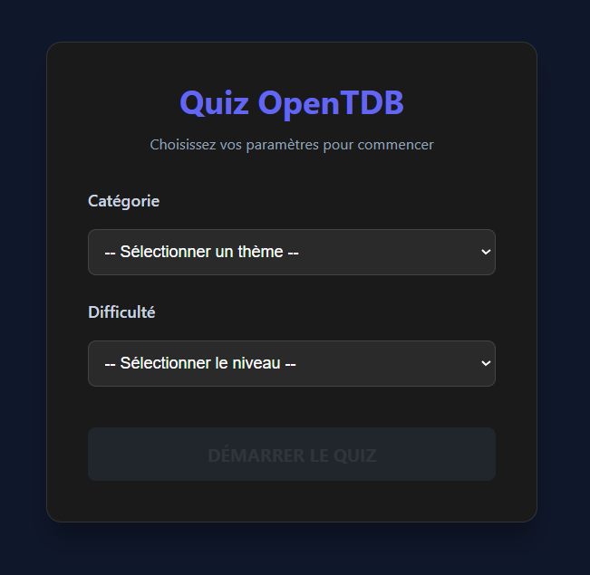
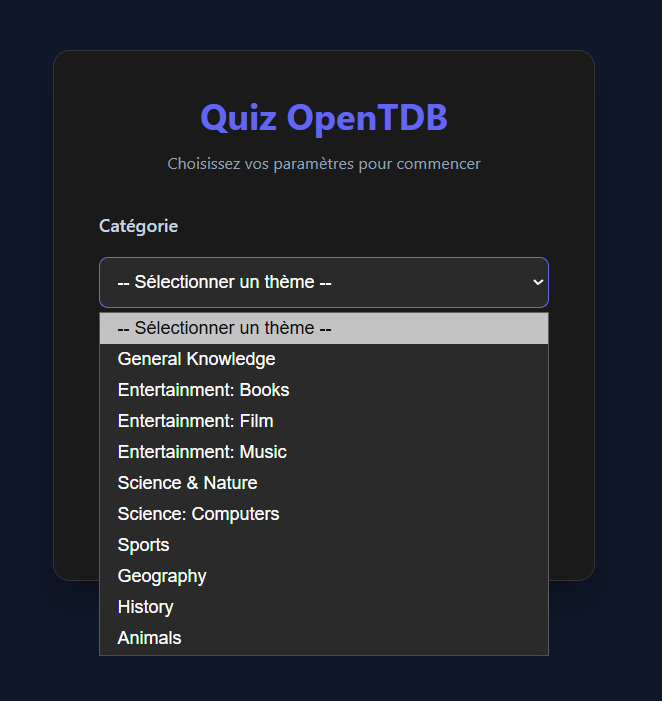
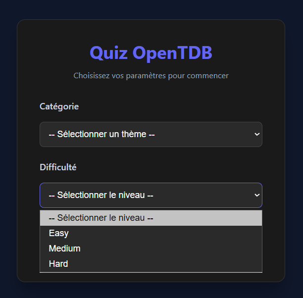
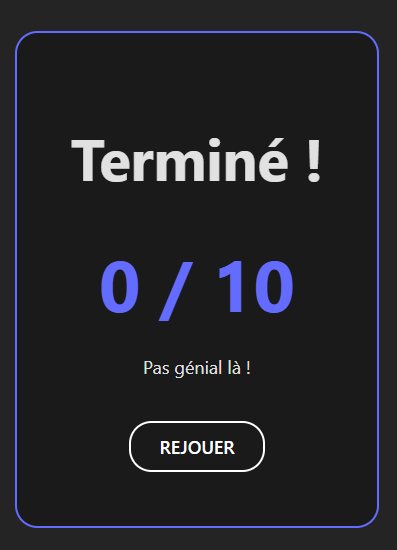
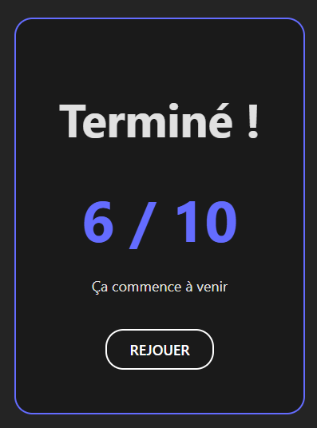
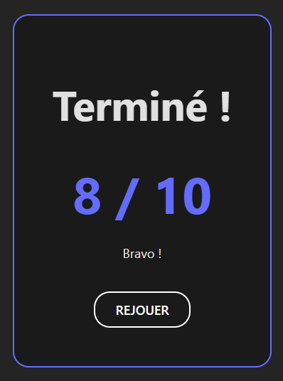
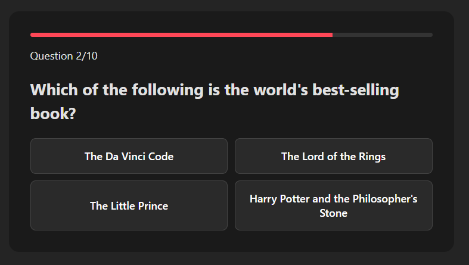

# Projet React

## Lancer le projet : npm run dev

### lancer dans le navigateur : localhost:5173/host

#### Guilhot Noa : Home_page

#### Arnaud Monel : _page

#### Esteban Mignotte : _page

